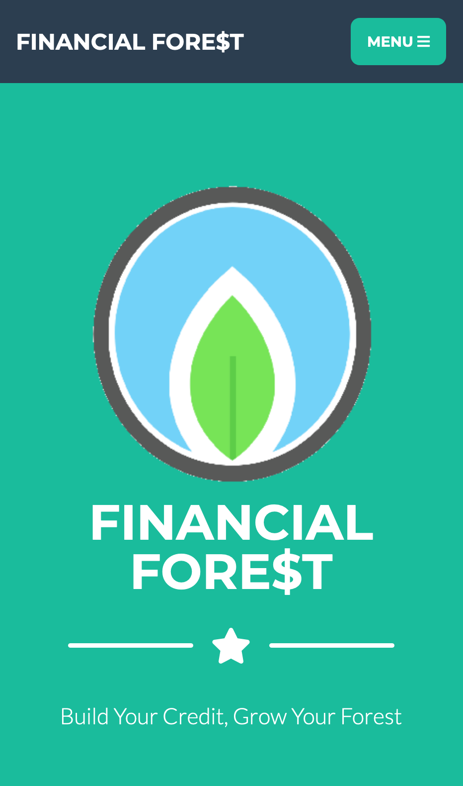
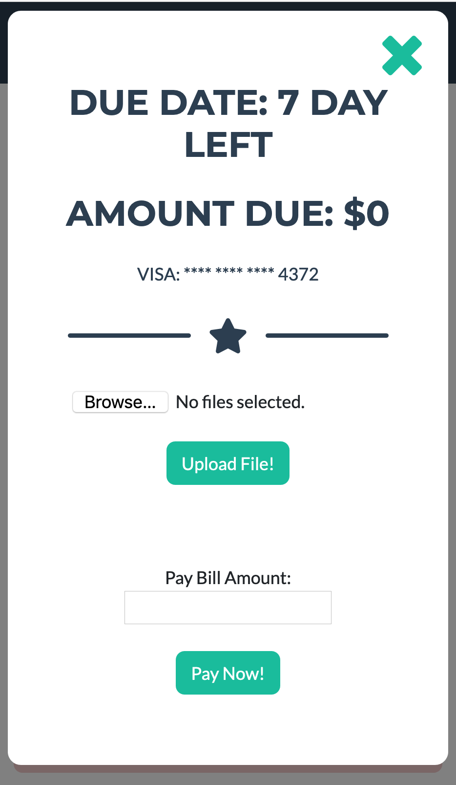

# Financial Fore$t
Scalable youth finance app improving financial management, literacy and credit score with a positive environmental impact. 
www.financial-forest.appspot.com

# What it does
* Forest is the user's credit score. 
* A new sapling is planted each month to represent the start of a new credit cycle 
* With each purchase under the credit limit, we record and track the receipts using Google Vision API to total the monthly statement owed for that card (that tree) 
* At the end of each month, if the credit spends is less than the limit AND gets paid back before the deadline, a new mature tree is added to the forest, increasing credit score/forest health
* If it spending is over the limit or it is not paid in time, the sapling is planted in a chopped/withers state to illustrate the permanent impact on credit score/ forest health.

# Demo
 
  
 
  

# Built
* Scalable Google App Engine (Host and Publish WebApp) 
* Google Cloud Platform & Vision API for the option to upload images of receipts and used label detection to scrape for the total amount paid 
* HTML and CSS front end supporting both mobile and web applications 
* Javascript and node.js/express backend 
* And many other frameworks and libraries ...

# Inspiration
The financial literacy gap between youth and adulthood can have a crucial impact on an important transitional time of their lives. One’s financial habits can make or break the individual future plans due to the limitations one’s credit history can have; 
whether it is pursuing post-secondary education or purchase their first home.

In light of the detrimental impact on our environment from humans causing global warming, deforestation and air pollution we plant a new tree for every 100 trees in our user's forest.

# Lessons 
Clear communication, Shared direction and goal among team,  Version control,  Scalability and extension of products

# Challenges
Version control, Distributing work, Google Vision API integration, Connecting the front end and the back end

DevPost: https://devpost.com/software/financial-fore-t-8k5tbq 
